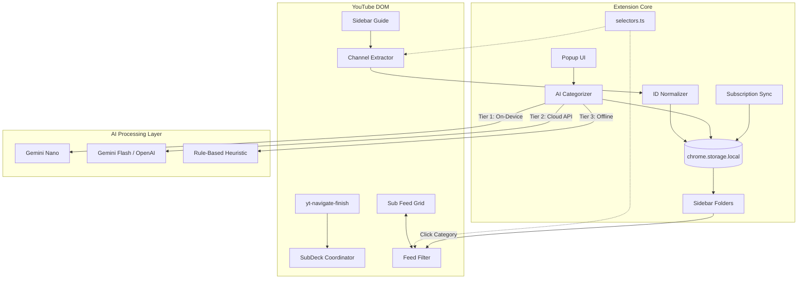

# SubDeck — Build Manual
### Smart Subscription Folders for YouTube™ · 6-Day One-Shot Build Spec

> **What this document is:** A battle-tested, day-by-day engineering blueprint with complete, production-ready code for every file. Each day is designed to be built in a single Antigravity session — paste the Antigravity Prompt, get working code.

---

## Project Overview

**SubDeck** is a privacy-first Manifest V3 Chrome Extension that organizes YouTube subscriptions into collapsible category folders with AI-powered auto-categorization.

### Core Capabilities
1. **AI Auto-Categorization** — Gemini Nano (on-device) → Cloud API (Gemini / OpenAI) → Heuristic fallback.
2. **Native Sidebar Folders** — Collapsible accordion decks injected into YouTube's sidebar (`ytd-guide-renderer`).
3. **Feed Filtering** — Click a folder to filter `/feed/subscriptions` to display only videos uploaded by channels in that category.
4. **Live Sync** — Auto-detects new subscriptions in real time and places them in an Uncategorized deck.
5. **Local-First & Safe** — No OAuth login, no YouTube Data API quotas; all configurations persist in `chrome.storage.local`.

---

## Architecture Flow



---

## Tech Stack & Tooling

| Layer | Technology |
|---|---|
| Language | TypeScript 5 (Strict Mode) |
| Build Tooling | Vite 5 + `@crxjs/vite-plugin` |
| Extension Target | Chrome Manifest V3 (MV3) |
| Storage | `chrome.storage.local` with typed schema wrapper |
| AI Inference | Chrome Built-in Prompt API (`ai.languageModel`) / Cloud APIs |
| Styling | Native CSS leveraging YouTube CSS custom properties |

---

## Directory Structure (Final)

```
SubDeck/
├── manifest.json
├── package.json
├── tsconfig.json
├── vite.config.ts
├── STORE_LISTING.md
├── PRIVACY_POLICY.md
├── scripts/
│   └── package.sh
├── .github/
│   └── workflows/
│       └── build-and-release.yml
├── assets/
│   └── icons/
│       ├── icon16.png
│       ├── icon48.png
│       └── icon128.png
├── src/
│   ├── types/
│   │   └── index.ts
│   ├── config/
│   │   └── selectors.ts
│   ├── utils/
│   │   ├── logger.ts
│   │   ├── debounce.ts
│   │   ├── storage.ts
│   │   ├── idNormalizer.ts
│   │   ├── domObserver.ts
│   │   └── exportImport.ts
│   ├── content/
│   │   ├── index.ts
│   │   ├── channelExtractor.ts
│   │   ├── sidebarManager.ts
│   │   ├── feedFilter.ts
│   │   ├── subscriptionSync.ts
│   │   ├── healthMonitor.ts
│   │   └── styles/
│   │       └── subdeck.css
│   ├── ai/
│   │   ├── categorizer.ts
│   │   ├── prompts.ts
│   │   ├── geminiNanoAdapter.ts
│   │   ├── cloudAdapter.ts
│   │   └── heuristic.ts
│   ├── popup/
│   │   ├── popup.html
│   │   ├── popup.ts
│   │   └── popup.css
│   └── background/
│       ├── service-worker.ts
│       └── migrations.ts
└── dist/
```

---

## 6-Day Sprint Plan

| Day | Focus | Key Deliverables | Files |
|---|---|---|---|
| **1** | Foundation & Core Utilities | Manifest V3, Vite+CRXJS, Strict TypeScript, Storage Schema, Utils | 17 files |
| **2** | Channel Scraping & Sidebar Injection | Scraper, Normalizer, Sidebar Accordion, Health Monitor, Coordinator | 4 files |
| **3** | Feed Filtering & Live Sync | Sub Feed Filter, Infinite Scroll Compensation, Live Subscription Sync | 4 files |
| **4** | AI Categorization Engine | Prompts, Gemini Nano Adapter, Cloud Adapter, Heuristic Taxonomy | 5 files |
| **5** | Popup Management UI | Search, Category CRUD, Drag & Drop, Settings Sync, Import/Export | 4 files |
| **6** | Service Worker & Web Store Release | Background messaging, Alarms, Migrations, Packager, Store Listing | 7 files |

---

## DAY 1 — PROJECT FOUNDATION & CORE UTILITIES

**Goal**: Scaffold the entire project from scratch. After this day, `npm install` works, `npm run dev` compiles, and the extension loads into Chrome with working storage, types, and logging.

### Files to Create

| File Path | Description |
| --- | --- |
| `manifest.json` | MV3 manifest referencing source files for CRXJS bundler. |
| `package.json` | Dependencies, types (@types/chrome, @types/node), and build scripts. |
| `tsconfig.json` | Strict TypeScript compiler configuration with alias mapping. |
| `vite.config.ts` | Vite + CRXJS plugin configuration. |
| `src/types/index.ts` | Complete TypeScript interfaces, default schema, and constants. |
| `src/config/selectors.ts` | Centralized YouTube DOM selector registry. |
| `src/utils/logger.ts` | Scoped development logger. |
| `src/utils/debounce.ts` | Generic debounce and throttle utility. |
| `src/utils/storage.ts` | Strongly typed async storage wrapper for `chrome.storage.local`. |
| `src/utils/idNormalizer.ts` | Canonical channel ID and handle extractor. |
| `src/utils/domObserver.ts` | MutationObserver utility with automatic debouncing. |
| `src/utils/exportImport.ts` | JSON export and import utility for categories and channels. |
| `src/background/service-worker.ts` | Minimal MV3 background service worker. |
| `src/content/index.ts` | Minimal content script entry point. |
| `src/popup/popup.html` | Minimal popup HTML shell. |
| `src/popup/popup.ts` | Minimal popup entry point. |
| `src/popup/popup.css` | Popup styling placeholder. |
| `src/content/styles/subdeck.css` | Native YouTube theme styles with CSS variables. |

### Source Code

```json
// manifest.json
{
  "manifest_version": 3,
  "name": "SubDeck — Smart Subscription Folders",
  "version": "1.0.0",
  "description": "Smart Subscription Category Folders & Feed Curator for YouTube™",
  "permissions": ["storage", "alarms"],
  "host_permissions": ["*://*.youtube.com/*"],
  "background": {
    "service_worker": "src/background/service-worker.ts",
    "type": "module"
  },
  "content_scripts": [
    {
      "matches": ["*://*.youtube.com/*"],
      "js": ["src/content/index.ts"],
      "css": ["src/content/styles/subdeck.css"],
      "run_at": "document_end"
    }
  ],
  "action": {
    "default_popup": "src/popup/popup.html"
  },
  "icons": {
    "16": "assets/icons/icon16.png",
    "48": "assets/icons/icon48.png",
    "128": "assets/icons/icon128.png"
  }
}
```

```json
// package.json
{
  "name": "subdeck",
  "version": "1.0.0",
  "type": "module",
  "scripts": {
    "dev": "vite build --watch --mode development",
    "build": "vite build --mode production",
    "typecheck": "tsc --noEmit"
  },
  "devDependencies": {
    "@crxjs/vite-plugin": "^2.0.0-beta.23",
    "@types/chrome": "^0.0.268",
    "@types/node": "^20.12.7",
    "typescript": "^5.4.5",
    "vite": "^5.2.11"
  }
}
```

```json
// tsconfig.json
{
  "compilerOptions": {
    "target": "ES2022",
    "useDefineForClassFields": true,
    "module": "ESNext",
    "lib": ["ES2022", "DOM", "DOM.Iterable"],
    "skipLibCheck": true,
    "moduleResolution": "bundler",
    "resolveJsonModule": true,
    "isolatedModules": true,
    "noEmit": true,
    "strict": true,
    "noUnusedLocals": true,
    "noUnusedParameters": true,
    "noFallthroughCasesInSwitch": true,
    "baseUrl": ".",
    "paths": {
      "@/*": ["src/*"]
    }
  },
  "include": ["src"]
}
```

```typescript
// vite.config.ts
import { defineConfig } from 'vite';
import { crx } from '@crxjs/vite-plugin';
import manifest from './manifest.json';
import { resolve } from 'path';

export default defineConfig({
  resolve: {
    alias: {
      '@': resolve(__dirname, 'src'),
    },
  },
  plugins: [crx({ manifest })],
  build: {
    outDir: 'dist',
    emptyOutDir: true,
  },
});
```

```typescript
// src/types/index.ts
export interface SubscribedChannel {
  ucId: string;
  title: string;
  handle: string;
  url: string;
  avatarUrl: string;
  categoryIds: string[];
  discoveredAt: number;
}

export interface CategoryDeck {
  id: string;
  name: string;
  icon: string;
  color?: string;
  channelIds: string[];
  isCollapsed: boolean;
  sortOrder: number;
  isSystem?: boolean;
}

export interface SubDeckStorageSchema {
  version: number;
  categories: CategoryDeck[];
  channels: Record<string, SubscribedChannel>;
  activeCategoryId: string | null;
  handleToUcId: Record<string, string>;
  settings: {
    aiProvider: 'gemini-nano' | 'gemini-api' | 'openai' | 'heuristic';
    apiKey?: string;
    autoSyncOnSubscribe: boolean;
    hideShortsFromFeed: boolean;
    themeMode: 'auto' | 'dark' | 'light';
    telemetryOptIn: boolean;
  };
  lastScrapedAt: number;
}

export const UNCATEGORIZED_DECK: CategoryDeck = {
  id: '__uncategorized__',
  name: 'Uncategorized',
  icon: '📂',
  color: '#6B7280',
  channelIds: [],
  isCollapsed: false,
  sortOrder: 999,
  isSystem: true,
};

export const DEFAULT_STORAGE: SubDeckStorageSchema = {
  version: 1,
  categories: [UNCATEGORIZED_DECK],
  channels: {},
  activeCategoryId: null,
  handleToUcId: {},
  settings: {
    aiProvider: 'gemini-nano',
    autoSyncOnSubscribe: true,
    hideShortsFromFeed: false,
    themeMode: 'auto',
    telemetryOptIn: false,
  },
  lastScrapedAt: 0,
};

export interface SubDeckExportPayload {
  exportVersion: number;
  exportedAt: number;
  data: SubDeckStorageSchema;
}
```

```typescript
// src/config/selectors.ts
export const YT_SELECTORS = {
  guideRenderer: 'ytd-guide-renderer',
  guideSectionRenderer: 'ytd-guide-section-renderer',
  guideEntry: 'ytd-guide-entry-renderer',
  subscriptionSection: '#sections > ytd-guide-section-renderer:has(#guide-section-title)',
  richGridRenderer: 'ytd-rich-grid-renderer',
  richItemRenderer: 'ytd-rich-item-renderer',
  richSectionRenderer: 'ytd-rich-section-renderer',
  channelNameLink: 'ytd-channel-name a',
  videoOwnerRenderer: 'ytd-video-owner-renderer',
  channelAvatar: '#avatar yt-img-shadow img, #avatar img',
  channelHandle: '#channel-handle',
  pageManager: 'ytd-page-manager',
  browseRenderer: 'ytd-browse',
  continuationItem: 'ytd-continuation-item-renderer',
} as const;

export type SelectorKey = keyof typeof YT_SELECTORS;
```

```typescript
// src/utils/logger.ts
export class Logger {
  static info(...args: any[]) {
    if (import.meta.env.DEV) console.info('[SubDeck]', ...args);
  }
  static warn(...args: any[]) {
    if (import.meta.env.DEV) console.warn('[SubDeck]', ...args);
  }
  static error(...args: any[]) {
    if (import.meta.env.DEV) console.error('[SubDeck]', ...args);
  }
}
```

```typescript
// src/utils/debounce.ts
export function debounce<T extends (...args: any[]) => void>(
  func: T,
  delay: number = 150
): (...args: Parameters<T>) => void {
  let timeoutId: ReturnType<typeof setTimeout> | null = null;
  return function (this: any, ...args: Parameters<T>) {
    if (timeoutId !== null) clearTimeout(timeoutId);
    timeoutId = setTimeout(() => {
      timeoutId = null;
      func.apply(this, args);
    }, delay);
  };
}
```

```typescript
// src/utils/storage.ts
import { SubDeckStorageSchema, DEFAULT_STORAGE, SubscribedChannel } from '@/types';

export class SubDeckStorage {
  static async getAll(): Promise<SubDeckStorageSchema> {
    const data = await chrome.storage.local.get(null);
    if (!data.version) {
      await chrome.storage.local.set(DEFAULT_STORAGE);
      return DEFAULT_STORAGE;
    }
    return data as SubDeckStorageSchema;
  }

  static async setAll(data: Partial<SubDeckStorageSchema>): Promise<void> {
    await chrome.storage.local.set(data);
  }

  static async getChannels() {
    const data = await this.getAll();
    return data.channels;
  }

  static async addChannel(channel: SubscribedChannel) {
    const data = await this.getAll();
    data.channels[channel.ucId] = channel;
    data.handleToUcId[channel.handle] = channel.ucId;
    await this.setAll({ channels: data.channels, handleToUcId: data.handleToUcId });
  }

  static async removeChannel(ucId: string) {
    const data = await this.getAll();
    const channel = data.channels[ucId];
    if (channel) {
      delete data.handleToUcId[channel.handle];
      delete data.channels[ucId];
      await this.setAll({ channels: data.channels, handleToUcId: data.handleToUcId });
    }
  }

  static async getCategories() {
    const data = await this.getAll();
    return data.categories;
  }

  static async addChannelToCategory(ucId: string, categoryId: string) {
    const data = await this.getAll();
    const category = data.categories.find(c => c.id === categoryId);
    if (category && !category.channelIds.includes(ucId)) {
      category.channelIds.push(ucId);
      await this.setAll({ categories: data.categories });
    }
  }

  static async removeChannelFromCategory(ucId: string, categoryId: string) {
    const data = await this.getAll();
    const category = data.categories.find(c => c.id === categoryId);
    if (category) {
      category.channelIds = category.channelIds.filter(id => id !== ucId);
      await this.setAll({ categories: data.categories });
    }
  }

  static async getHandleToUcIdMap() {
    const data = await this.getAll();
    return data.handleToUcId;
  }

  static async setActiveCategoryId(id: string | null) {
    await this.setAll({ activeCategoryId: id });
  }

  static async getSettings() {
    const data = await this.getAll();
    return data.settings;
  }

  static async updateSettings(partial: Partial<SubDeckStorageSchema['settings']>) {
    const data = await this.getAll();
    data.settings = { ...data.settings, ...partial };
    await this.setAll({ settings: data.settings });
  }
}
```

```typescript
// src/utils/idNormalizer.ts
export class IdNormalizer {
  static extractFromAnchor(anchor: HTMLAnchorElement): { ucId: string | null; handle: string | null } {
    let ucId = anchor.getAttribute('data-browse-id') || null;
    if (ucId && !ucId.startsWith('UC')) ucId = null;

    const href = anchor.getAttribute('href') || '';
    if (!ucId) {
      const ucMatch = href.match(/\/channel\/(UC[a-zA-Z0-9_-]+)/);
      if (ucMatch) {
        ucId = ucMatch[1];
      }
    }

    let handle: string | null = null;
    const handleMatch = href.match(/\/@([a-zA-Z0-9_.-]+)/);
    if (handleMatch) {
      handle = '@' + handleMatch[1].toLowerCase();
    }

    return { ucId, handle };
  }
}
```

```typescript
// src/utils/domObserver.ts
import { debounce } from './debounce';

export function createDebouncedObserver(
  target: HTMLElement,
  callback: () => void,
  options: MutationObserverInit,
  debounceMs: number = 150
): MutationObserver {
  const debouncedCallback = debounce(callback, debounceMs);
  const observer = new MutationObserver(debouncedCallback);
  observer.observe(target, options);
  return observer;
}
```

```typescript
// src/utils/exportImport.ts
import { SubDeckStorageSchema, SubDeckExportPayload } from '@/types';
import { SubDeckStorage } from './storage';

export class ExportImport {
  static async exportToFile(): Promise<void> {
    const data = await SubDeckStorage.getAll();
    const payload: SubDeckExportPayload = {
      exportVersion: 1,
      exportedAt: Date.now(),
      data,
    };
    const blob = new Blob([JSON.stringify(payload, null, 2)], { type: 'application/json' });
    const url = URL.createObjectURL(blob);
    const a = document.createElement('a');
    a.href = url;
    a.download = `subdeck_backup_${new Date().toISOString().split('T')[0]}.json`;
    a.click();
    URL.revokeObjectURL(url);
  }

  static async importFromFile(file: File, mode: 'merge' | 'overwrite' = 'merge'): Promise<void> {
    const text = await file.text();
    const payload = JSON.parse(text) as SubDeckExportPayload;
    if (!payload.data || !payload.exportVersion) {
      throw new Error('Invalid SubDeck backup file format');
    }
    if (mode === 'overwrite') {
      await SubDeckStorage.setAll(payload.data);
    } else {
      const current = await SubDeckStorage.getAll();
      const existingCategoryIds = new Set(current.categories.map(c => c.id));
      const mergedCategories = [
        ...current.categories,
        ...payload.data.categories.filter(c => !existingCategoryIds.has(c.id)),
      ];
      const mergedChannels = { ...current.channels, ...payload.data.channels };
      const mergedHandles = { ...current.handleToUcId, ...payload.data.handleToUcId };
      await SubDeckStorage.setAll({
        categories: mergedCategories,
        channels: mergedChannels,
        handleToUcId: mergedHandles,
      });
    }
  }
}
```

```typescript
// src/background/service-worker.ts
import { SubDeckStorage } from '@/utils/storage';

chrome.runtime.onInstalled.addListener(async () => {
  await SubDeckStorage.getAll();
  console.log('[SubDeck] Service worker initialized');
});
```

```typescript
// src/content/index.ts
console.log('[SubDeck] Content script loaded');
```

```html
<!-- src/popup/popup.html -->
<!DOCTYPE html>
<html lang="en">
<head>
  <meta charset="UTF-8">
  <title>SubDeck</title>
  <link rel="stylesheet" href="popup.css">
</head>
<body>
  <div id="app">SubDeck Loading...</div>
  <script type="module" src="popup.ts"></script>
</body>
</html>
```

```typescript
// src/popup/popup.ts
console.log('[SubDeck] Popup loaded');
```

```css
/* src/popup/popup.css */
/* Minimal popup styling */
body {
  width: 380px;
  margin: 0;
  font-family: Roboto, Arial, sans-serif;
}
```

```css
/* src/content/styles/subdeck.css */
.subdeck-folder-container {
  margin: 4px 0;
  border-radius: 8px;
  background-color: transparent;
  color: var(--yt-spec-text-primary, #0f0f0f);
  font-family: Roboto, Arial, sans-serif;
  overflow: hidden;
}

.subdeck-folder-header {
  display: flex;
  align-items: center;
  padding: 8px 16px;
  cursor: pointer;
  border-radius: 8px;
  transition: background-color 0.15s ease;
  user-select: none;
}

.subdeck-folder-header:hover {
  background-color: var(--yt-spec-badge-chip-background, rgba(0, 0, 0, 0.05));
}

.subdeck-folder-header.active-filter {
  background-color: var(--yt-spec-brand-background-primary, rgba(255, 0, 0, 0.1));
  font-weight: 600;
}

.subdeck-channel-list {
  max-height: 0;
  overflow: hidden;
  transition: max-height 0.25s cubic-bezier(0.4, 0, 0.2, 1);
  padding-left: 12px;
}

.subdeck-channel-list:not(.collapsed) {
  max-height: 2500px;
}

.subdeck-channel-item {
  display: flex;
  align-items: center;
  padding: 6px 12px;
  cursor: pointer;
  border-radius: 6px;
  text-decoration: none;
  color: var(--yt-spec-text-primary, #0f0f0f);
  font-size: 13px;
  transition: background-color 0.15s ease;
}

.subdeck-channel-item:hover {
  background-color: var(--yt-spec-badge-chip-background, rgba(0, 0, 0, 0.05));
}

.subdeck-channel-avatar {
  width: 24px;
  height: 24px;
  border-radius: 50%;
  margin-right: 8px;
  object-fit: cover;
}

.subdeck-channel-count {
  margin-left: auto;
  font-size: 11px;
  color: var(--yt-spec-text-secondary, #606060);
}

.subdeck-chevron {
  margin-left: 8px;
  font-size: 10px;
  transition: transform 0.2s ease;
}

.subdeck-chevron.open {
  transform: rotate(180deg);
}

.subdeck-degradation-banner,
.subdeck-feed-banner {
  background-color: var(--yt-spec-badge-chip-background, #f2f2f2);
  color: var(--yt-spec-text-primary, #0f0f0f);
  padding: 10px 18px;
  display: flex;
  justify-content: space-between;
  align-items: center;
  margin: 8px 16px;
  border-radius: 8px;
  font-size: 13px;
}

.subdeck-banner-dismiss,
.subdeck-clear-filter {
  cursor: pointer;
  color: var(--yt-spec-text-primary, #0f0f0f);
  background: transparent;
  border: 1px solid var(--yt-spec-text-secondary, #606060);
  border-radius: 4px;
  padding: 4px 10px;
  font-size: 12px;
  font-weight: 500;
}
```

### Acceptance Criteria
- [ ] `npm install` installs cleanly with `@types/chrome` and `@types/node`.
- [ ] `npm run typecheck` (`tsc --noEmit`) passes with zero TypeScript errors.
- [ ] `npm run build` generates a complete `dist/` directory containing `manifest.json`.
- [ ] Loading `dist/` as an unpacked extension in Chrome works without warnings.
- [ ] Navigating to `youtube.com` logs `[SubDeck] Content script loaded`.
- [ ] `chrome.storage.local.get(null)` contains `DEFAULT_STORAGE` with `UNCATEGORIZED_DECK`.

### Antigravity Prompt
```text
Build Day 1 of SubDeck: scaffolding, storage, and utilities. Use the specifications above to create all foundation files, manifest, types, and setup scripts. Ensure the extension is strictly typed, installs via npm, builds flawlessly with vite, and loads gracefully into Chrome.
```

---

## DAY 2 — CHANNEL EXTRACTION & SIDEBAR INJECTION

**Goal**: SubDeck extracts all subscribed channels from YouTube's sidebar DOM and injects collapsible category folder accordions directly above the native subscription list.

### Files to Create/Modify

| File Path | Description |
| --- | --- |
| `src/content/channelExtractor.ts` | Scrapes channels from sidebar entries and feed cards cleanly. |
| `src/content/sidebarManager.ts` | Injects collapsible folder UI into YouTube sidebar and handles click navigation. |
| `src/content/healthMonitor.ts` | Validates DOM selectors with CSP-safe error banner notification. |
| `src/content/index.ts` | Coordinator wiring SPA navigation events and DOM injection. |

### Source Code

```typescript
// src/content/channelExtractor.ts
import { YT_SELECTORS } from '@/config/selectors';
import { IdNormalizer } from '@/utils/idNormalizer';
import { SubscribedChannel } from '@/types';

export class ChannelExtractor {
  static scrapeFromSidebar(): SubscribedChannel[] {
    const channels: SubscribedChannel[] = [];
    const entries = document.querySelectorAll(
      `${YT_SELECTORS.subscriptionSection} ${YT_SELECTORS.guideEntry}`
    );

    entries.forEach(entry => {
      const anchor = entry.querySelector('a') as HTMLAnchorElement | null;
      if (!anchor) return;

      const { ucId, handle } = IdNormalizer.extractFromAnchor(anchor);
      if (!ucId) return;

      const titleEl = entry.querySelector('yt-formatted-string') as HTMLElement | null;
      const title = titleEl ? titleEl.innerText.trim() : (handle || 'Channel');

      const imgEl = entry.querySelector('img') as HTMLImageElement | null;
      const avatarUrl = imgEl ? imgEl.src : '';

      channels.push({
        ucId,
        title,
        handle: handle || `@${ucId}`,
        url: anchor.href,
        avatarUrl,
        categoryIds: [],
        discoveredAt: Date.now(),
      });
    });

    return channels;
  }

  static scrapeFromFeedCard(card: HTMLElement): { ucId: string | null; handle: string | null } | null {
    const anchor = card.querySelector(YT_SELECTORS.channelNameLink) as HTMLAnchorElement | null;
    if (!anchor) return null;
    return IdNormalizer.extractFromAnchor(anchor);
  }
}
```

```typescript
// src/content/sidebarManager.ts
import { YT_SELECTORS } from '@/config/selectors';
import { SubDeckStorage } from '@/utils/storage';
import { ChannelExtractor } from './channelExtractor';
import { CategoryDeck } from '@/types';

export class SidebarManager {
  private static containerId = 'subdeck-sidebar-container';

  static async ensureInjected(): Promise<void> {
    const subSection = document.querySelector(YT_SELECTORS.subscriptionSection);
    if (!subSection) return;

    let container = document.getElementById(this.containerId);
    if (!container) {
      container = document.createElement('div');
      container.id = this.containerId;
      subSection.parentNode?.insertBefore(container, subSection);
    }

    await this.render();
  }

  static async render(): Promise<void> {
    const container = document.getElementById(this.containerId);
    if (!container) return;

    container.innerHTML = '';

    const categories = await SubDeckStorage.getCategories();
    const channelsMap = await SubDeckStorage.getChannels();
    const activeCategory = (await SubDeckStorage.getAll()).activeCategoryId;

    // Show All Button
    const showAllBtn = document.createElement('button');
    showAllBtn.innerText = '☰ Show All Subscriptions';
    showAllBtn.className = 'subdeck-clear-filter';
    showAllBtn.style.width = 'calc(100% - 24px)';
    showAllBtn.style.margin = '4px 12px 8px 12px';
    showAllBtn.addEventListener('click', () => {
      document.querySelectorAll('.subdeck-folder-header').forEach(el => el.classList.remove('active-filter'));
      document.dispatchEvent(new CustomEvent('subdeck-filter-category', { detail: null }));
    });
    container.appendChild(showAllBtn);

    categories
      .slice()
      .sort((a, b) => a.sortOrder - b.sortOrder)
      .forEach(cat => {
        const folder = document.createElement('div');
        folder.className = 'subdeck-folder-container';

        const header = document.createElement('div');
        header.className = `subdeck-folder-header ${activeCategory === cat.id ? 'active-filter' : ''}`;
        header.innerHTML = `
          <span>${cat.icon}</span>
          <span style="margin-left: 8px; font-weight: 500;">${cat.name}</span>
          <span class="subdeck-channel-count">${cat.channelIds.length}</span>
          <span class="subdeck-chevron ${cat.isCollapsed ? '' : 'open'}">▼</span>
        `;

        const list = document.createElement('div');
        list.className = `subdeck-channel-list ${cat.isCollapsed ? 'collapsed' : ''}`;

        cat.channelIds.forEach(id => {
          const ch = channelsMap[id];
          if (!ch) return;
          const item = document.createElement('a');
          item.className = 'subdeck-channel-item';
          item.href = ch.url;
          item.innerHTML = `
            
            <span>${ch.title}</span>
          `;
          list.appendChild(item);
        });

        header.addEventListener('click', async () => {
          const chevron = header.querySelector('.subdeck-chevron');
          const isNowCollapsed = !list.classList.contains('collapsed');
          list.classList.toggle('collapsed');
          chevron?.classList.toggle('open', !isNowCollapsed);

          cat.isCollapsed = isNowCollapsed;
          await SubDeckStorage.setAll({ categories });

          if (window.location.pathname.startsWith('/feed/subscriptions')) {
            document.querySelectorAll('.subdeck-folder-header').forEach(el => el.classList.remove('active-filter'));
            header.classList.add('active-filter');
            document.dispatchEvent(new CustomEvent('subdeck-filter-category', { detail: cat }));
          }
        });

        folder.appendChild(header);
        folder.appendChild(list);
        container.appendChild(folder);
      });
  }

  static async syncWithNativeSubscriptions(): Promise<void> {
    const scraped = ChannelExtractor.scrapeFromSidebar();
    const storageChannels = await SubDeckStorage.getChannels();
    let hasChanges = false;

    for (const ch of scraped) {
      if (!storageChannels[ch.ucId]) {
        await SubDeckStorage.addChannel(ch);
        await SubDeckStorage.addChannelToCategory(ch.ucId, '__uncategorized__');
        hasChanges = true;
      }
    }

    if (hasChanges) {
      await this.render();
    }
  }
}
```

```typescript
// src/content/healthMonitor.ts
import { YT_SELECTORS } from '@/config/selectors';

export class HealthMonitor {
  static validateSelectors(): boolean {
    const required = [YT_SELECTORS.pageManager, YT_SELECTORS.guideRenderer];
    for (const sel of required) {
      if (!document.querySelector(sel)) return false;
    }
    return true;
  }

  static showDegradationBanner(): void {
    if (document.getElementById('subdeck-degradation-banner')) return;
    const banner = document.createElement('div');
    banner.id = 'subdeck-degradation-banner';
    banner.className = 'subdeck-degradation-banner';
    banner.innerHTML = `
      <span>⚠️ YouTube layout has changed. SubDeck is running in degraded mode.</span>
      <button class="subdeck-banner-dismiss" id="subdeck-dismiss-btn">✕</button>
    `;
    banner.querySelector('#subdeck-dismiss-btn')?.addEventListener('click', () => {
      banner.remove();
    });
    document.body.prepend(banner);
  }

  static hideDegradationBanner(): void {
    document.getElementById('subdeck-degradation-banner')?.remove();
  }
}
```

```typescript
// src/content/index.ts
import { SidebarManager } from './sidebarManager';
import { HealthMonitor } from './healthMonitor';
import { debounce } from '@/utils/debounce';
import { Logger } from '@/utils/logger';

class SubDeckCoordinator {
  static init(): void {
    Logger.info('Initializing SubDeck Coordinator');
    window.addEventListener('yt-navigate-finish', this.handleNavigation);
    window.addEventListener('yt-page-data-updated', this.handleDataUpdate);
    this.waitForYouTubeReady();
  }

  static waitForYouTubeReady(): void {
    const observer = new MutationObserver((_, obs) => {
      if (document.querySelector('ytd-app')) {
        obs.disconnect();
        this.handleNavigation();
      }
    });
    observer.observe(document.body, { childList: true, subtree: true });
  }

  static handleNavigation = debounce(async () => {
    if (!HealthMonitor.validateSelectors()) {
      HealthMonitor.showDegradationBanner();
    } else {
      HealthMonitor.hideDegradationBanner();
      await SidebarManager.ensureInjected();
      await SidebarManager.syncWithNativeSubscriptions();
    }
  }, 400);

  static handleDataUpdate = debounce(async () => {
    await SidebarManager.syncWithNativeSubscriptions();
  }, 400);
}

SubDeckCoordinator.init();
```

### Acceptance Criteria
- [ ] SubDeck folder accordions appear in the YouTube sidebar without breaking native layout.
- [ ] Scraped channels automatically populate the "Uncategorized" folder.
- [ ] Clicking a folder header toggles expansion and animates the chevron cleanly.
- [ ] Channel items display channel avatars and navigate to the channel on click.
- [ ] No inline `onclick` CSP violations appear in the console.

### Antigravity Prompt
```text
Build Day 2 of SubDeck: channel extraction and sidebar injection. Create the extraction logic, inject the interactive folder UI into the YouTube sidebar, and ensure the coordinator ties everything together gracefully with the health monitor.
```

---

## DAY 3 — FEED FILTERING, INFINITE SCROLL & LIVE SYNC

**Goal**: Clicking a category folder on `/feed/subscriptions` filters video items in real time, auto-compensates infinite scroll, and safely syncs new subscriptions without data loss.

### Files to Create/Modify

| File Path | Description |
| --- | --- |
| `src/content/feedFilter.ts` | Filters feed items by category, hides Shorts if configured, auto-loads more. |
| `src/content/subscriptionSync.ts` | Safely observes sidebar for newly added subscriptions without wiping data. |
| `src/content/index.ts` | (Modified) Integrates feed filtering and sync events into coordinator. |

### Source Code

```typescript
// src/content/feedFilter.ts
import { YT_SELECTORS } from '@/config/selectors';
import { CategoryDeck } from '@/types';
import { SubDeckStorage } from '@/utils/storage';
import { ChannelExtractor } from './channelExtractor';
import { createDebouncedObserver } from '@/utils/domObserver';

export class FeedFilter {
  private static activeCategory: CategoryDeck | null = null;
  private static observer: MutationObserver | null = null;
  private static isLoadingMore = false;

  static async applyFilter(category: CategoryDeck | null): Promise<void> {
    this.activeCategory = category;
    await SubDeckStorage.setActiveCategoryId(category ? category.id : null);
    this.renderCategoryBanner();
    await this.filterVisibleVideos();
  }

  static async filterVisibleVideos(): Promise<void> {
    const settings = await SubDeckStorage.getSettings();

    // Hide Shorts shelves if setting enabled
    if (settings.hideShortsFromFeed) {
      document.querySelectorAll<HTMLElement>(YT_SELECTORS.richSectionRenderer).forEach(shelf => {
        if (shelf.innerHTML.includes('shorts') || shelf.querySelector('[aria-label*="Shorts"]')) {
          shelf.style.display = 'none';
        }
      });
    }

    if (!this.activeCategory) {
      document.querySelectorAll<HTMLElement>(YT_SELECTORS.richItemRenderer).forEach(el => {
        el.style.display = '';
      });
      return;
    }

    const allowedUcIds = new Set(this.activeCategory.channelIds);
    const handleMap = await SubDeckStorage.getHandleToUcIdMap();
    let visibleCount = 0;

    document.querySelectorAll<HTMLElement>(YT_SELECTORS.richItemRenderer).forEach(card => {
      const info = ChannelExtractor.scrapeFromFeedCard(card);
      let ucId = info?.ucId;
      if (!ucId && info?.handle) {
        ucId = handleMap[info.handle];
      }

      if (ucId && allowedUcIds.has(ucId)) {
        card.style.display = '';
        visibleCount++;
      } else {
        card.style.display = 'none';
      }
    });

    if (visibleCount < 8 && this.activeCategory) {
      await this.triggerContinuationLoad();
    }
  }

  private static async triggerContinuationLoad(): Promise<void> {
    if (this.isLoadingMore) return;
    this.isLoadingMore = true;

    let attempt = 0;
    while (attempt < 4) {
      const continuation = document.querySelector<HTMLElement>(YT_SELECTORS.continuationItem);
      if (!continuation) break;

      continuation.scrollIntoView({ behavior: 'instant', block: 'center' });
      await new Promise(r => setTimeout(r, 900));
      await this.filterVisibleVideos();

      const visible = document.querySelectorAll<HTMLElement>(
        `${YT_SELECTORS.richItemRenderer}:not([style*="display: none"])`
      ).length;
      if (visible >= 8) break;
      attempt++;
    }
    this.isLoadingMore = false;
  }

  static attachFeedObserver(): void {
    const grid = document.querySelector(YT_SELECTORS.richGridRenderer);
    if (!grid || this.observer) return;
    this.observer = createDebouncedObserver(
      grid as HTMLElement,
      () => this.filterVisibleVideos(),
      { childList: true, subtree: true },
      250
    );
  }

  static detachFeedObserver(): void {
    if (this.observer) {
      this.observer.disconnect();
      this.observer = null;
    }
  }

  static renderCategoryBanner(): void {
    let banner = document.getElementById('subdeck-category-banner');
    if (!this.activeCategory) {
      banner?.remove();
      return;
    }
    if (!banner) {
      banner = document.createElement('div');
      banner.id = 'subdeck-category-banner';
      banner.className = 'subdeck-feed-banner';
      const container = document.querySelector(YT_SELECTORS.pageManager);
      container?.prepend(banner);
    }
    banner.innerHTML = `
      <span>${this.activeCategory.icon} Showing: <strong>${this.activeCategory.name}</strong> (${this.activeCategory.channelIds.length} channels)</span>
      <button class="subdeck-clear-filter" id="subdeck-clear-btn">✕ Show All</button>
    `;
    banner.querySelector('#subdeck-clear-btn')?.addEventListener('click', () => {
      document.querySelectorAll('.subdeck-folder-header').forEach(el => el.classList.remove('active-filter'));
      document.dispatchEvent(new CustomEvent('subdeck-filter-category', { detail: null }));
    });
  }
}
```

```typescript
// src/content/subscriptionSync.ts
import { YT_SELECTORS } from '@/config/selectors';
import { createDebouncedObserver } from '@/utils/domObserver';
import { SidebarManager } from './sidebarManager';
import { SubDeckStorage } from '@/utils/storage';
import { ChannelExtractor } from './channelExtractor';

export class SubscriptionSync {
  private static observer: MutationObserver | null = null;

  static attach(): void {
    const section = document.querySelector(YT_SELECTORS.subscriptionSection);
    if (!section || this.observer) return;
    this.observer = createDebouncedObserver(
      section as HTMLElement,
      () => this.safeSync(),
      { childList: true, subtree: true },
      500
    );
  }

  static async safeSync(): Promise<void> {
    const settings = await SubDeckStorage.getSettings();
    if (!settings.autoSyncOnSubscribe) return;

    const currentList = ChannelExtractor.scrapeFromSidebar();
    const storageChannels = await SubDeckStorage.getChannels();
    let changed = false;

    // Only ADD newly detected subscriptions (safe against collapsed sidebar)
    for (const c of currentList) {
      if (!storageChannels[c.ucId]) {
        await SubDeckStorage.addChannel(c);
        await SubDeckStorage.addChannelToCategory(c.ucId, '__uncategorized__');
        changed = true;
      }
    }

    if (changed) {
      await SidebarManager.render();
    }
  }

  static detach(): void {
    if (this.observer) {
      this.observer.disconnect();
      this.observer = null;
    }
  }
}
```

```typescript
// src/content/index.ts (MODIFIED)
import { SidebarManager } from './sidebarManager';
import { HealthMonitor } from './healthMonitor';
import { FeedFilter } from './feedFilter';
import { SubscriptionSync } from './subscriptionSync';
import { debounce } from '@/utils/debounce';
import { Logger } from '@/utils/logger';

class SubDeckCoordinator {
  static init(): void {
    Logger.info('Initializing SubDeck Coordinator');
    window.addEventListener('yt-navigate-finish', this.handleNavigation);
    window.addEventListener('yt-page-data-updated', this.handleDataUpdate);
    document.addEventListener('subdeck-filter-category', (e: any) => {
      FeedFilter.applyFilter(e.detail);
    });
    this.waitForYouTubeReady();
  }

  static waitForYouTubeReady(): void {
    const observer = new MutationObserver((_, obs) => {
      if (document.querySelector('ytd-app')) {
        obs.disconnect();
        this.handleNavigation();
      }
    });
    observer.observe(document.body, { childList: true, subtree: true });
  }

  static handleNavigation = debounce(async () => {
    if (!HealthMonitor.validateSelectors()) {
      HealthMonitor.showDegradationBanner();
    } else {
      HealthMonitor.hideDegradationBanner();
      await SidebarManager.ensureInjected();
      await SidebarManager.syncWithNativeSubscriptions();

      SubscriptionSync.attach();

      if (window.location.pathname.startsWith('/feed/subscriptions')) {
        FeedFilter.attachFeedObserver();
        await FeedFilter.filterVisibleVideos();
      } else {
        FeedFilter.detachFeedObserver();
      }
    }
  }, 400);

  static handleDataUpdate = debounce(async () => {
    await SidebarManager.syncWithNativeSubscriptions();
  }, 400);
}

SubDeckCoordinator.init();
```

### Acceptance Criteria
- [ ] On `/feed/subscriptions`, clicking a folder filters videos to only show uploaded videos from that category.
- [ ] A feed banner displays the active category with a functional "Show All" button.
- [ ] If filtered results show fewer than 8 videos, more content loads automatically.
- [ ] New subscriptions in the sidebar are automatically detected and placed in "Uncategorized".
- [ ] Existing stored subscriptions are **NEVER wiped** by sidebar sync.

### Antigravity Prompt
```text
Build Day 3 of SubDeck: Feed Filtering, Infinite Scroll, and Live Sync. Wire up the FeedFilter class to handle DOM mutations in the video grid. Add the SubscriptionSync observer to keep local storage consistent with YouTube's state, and integrate everything into index.ts.
```

---

## DAY 4 — AI CATEGORIZATION ENGINE

**Goal**: Build the full 3-tier AI auto-categorization system: Gemini Nano on-device, Cloud API fallback (Gemini/OpenAI), and rule-based heuristic keyword clustering.

### Files to Create

| File Path | Description |
| --- | --- |
| `src/ai/prompts.ts` | Strict JSON prompts for one-shot clustering and incremental channel refinement. |
| `src/ai/geminiNanoAdapter.ts` | Environment-safe adapter for Chrome Built-in Prompt API (`ai.languageModel`). |
| `src/ai/cloudAdapter.ts` | Cloud API adapter for Gemini 2.0/2.5 Flash and OpenAI GPT-4o-mini. |
| `src/ai/heuristic.ts` | 8-category keyword taxonomy with zero-loss fallback for unassigned channels. |
| `src/ai/categorizer.ts` | Orchestration engine managing tier fallback, JSON schema validation, and storage persistence. |

### Source Code

```typescript
// src/ai/prompts.ts
export function buildCategorizationPrompt(channels: { id: string; name: string; handle: string }[]): string {
  return `You are an expert digital content curator. Analyze the following list of YouTube channels and cluster them into 4 to 8 intuitive, distinct category decks.

Rules:
1. Every channel MUST be assigned to exactly one category.
2. Categories should be meaningfully distinct — avoid overlapping themes.
3. If a channel does not fit cleanly, place it in the closest general match.
4. Use concise, user-friendly category names (2-4 words max).

Output Schema Requirements:
Return ONLY a valid JSON array matching this exact schema (no conversational text or markdown code fences):
[
  {
    "id": "kebab-case-slug",
    "name": "Concise Category Title",
    "icon": "💻",
    "color": "#3B82F6",
    "channelIds": ["channel_id_1", "channel_id_2"]
  }
]

Channels to categorize:
${JSON.stringify(channels, null, 2)}`;
}

export function buildRefinementPrompt(
  existingCategories: { id: string; name: string }[],
  newChannels: { id: string; name: string; handle: string }[]
): string {
  return `You are an expert digital content curator. Assign the following new YouTube channels to the most appropriate existing categories.

Existing categories:
${JSON.stringify(existingCategories, null, 2)}

Output Schema Requirements:
Return ONLY a valid JSON array containing the updated categories with new channel IDs appended:
[
  {
    "id": "existing-id",
    "name": "Existing Name",
    "channelIds": ["new_channel_id"]
  }
]

New channels to categorize:
${JSON.stringify(newChannels, null, 2)}`;
}
```

```typescript
// src/ai/geminiNanoAdapter.ts
export class GeminiNanoAdapter {
  private getAiHost(): any {
    if (typeof window !== 'undefined' && (window as any).ai) {
      return (window as any).ai;
    }
    if (typeof self !== 'undefined' && (self as any).ai) {
      return (self as any).ai;
    }
    return undefined;
  }

  async isAvailable(): Promise<boolean> {
    const ai = this.getAiHost();
    if (!ai?.languageModel) return false;
    try {
      const capabilities = await ai.languageModel.capabilities();
      return capabilities.available === 'readily' || capabilities.available === 'after-download';
    } catch {
      return false;
    }
  }

  async categorize(prompt: string): Promise<string> {
    const ai = this.getAiHost();
    if (!ai?.languageModel) {
      throw new Error('Gemini Nano Prompt API is not supported on this browser.');
    }

    const session = await ai.languageModel.create({
      temperature: 0.1,
      topK: 1,
      systemPrompt: 'You are an expert content curator. Always respond with strict, parseable JSON only.',
    });

    try {
      return await session.prompt(prompt);
    } finally {
      if (typeof session.destroy === 'function') {
        session.destroy();
      }
    }
  }
}
```

```typescript
// src/ai/cloudAdapter.ts
export class CloudAdapter {
  constructor(
    private provider: 'gemini-api' | 'openai',
    private apiKey: string
  ) {}

  async categorize(prompt: string): Promise<string> {
    if (!this.apiKey) {
      throw new Error(`API key is required for ${this.provider}.`);
    }

    if (this.provider === 'gemini-api') {
      return this.callGemini(prompt);
    } else {
      return this.callOpenAI(prompt);
    }
  }

  private async callGemini(prompt: string): Promise<string> {
    const url = `https://generativelanguage.googleapis.com/v1beta/models/gemini-2.0-flash:generateContent?key=${encodeURIComponent(this.apiKey)}`;
    const response = await fetch(url, {
      method: 'POST',
      headers: { 'Content-Type': 'application/json' },
      body: JSON.stringify({
        contents: [{ role: 'user', parts: [{ text: prompt }] }],
        generationConfig: { temperature: 0.1 },
      }),
    });

    if (!response.ok) {
      throw new Error(`Gemini API Error (${response.status}): ${response.statusText}`);
    }

    const data = await response.json();
    return data.candidates?.[0]?.content?.parts?.[0]?.text || '';
  }

  private async callOpenAI(prompt: string): Promise<string> {
    const url = 'https://api.openai.com/v1/chat/completions';
    const response = await fetch(url, {
      method: 'POST',
      headers: {
        'Content-Type': 'application/json',
        Authorization: `Bearer ${this.apiKey}`,
      },
      body: JSON.stringify({
        model: 'gpt-4o-mini',
        messages: [
          { role: 'system', content: 'You are an expert content curator. Output strict JSON only.' },
          { role: 'user', content: prompt },
        ],
        temperature: 0.1,
      }),
    });

    if (!response.ok) {
      throw new Error(`OpenAI API Error (${response.status}): ${response.statusText}`);
    }

    const data = await response.json();
    return data.choices?.[0]?.message?.content || '';
  }
}
```

```typescript
// src/ai/heuristic.ts
export const HEURISTIC_CATEGORIES = [
  { id: 'tech-coding', name: 'Tech & Coding', icon: '💻', color: '#3B82F6' },
  { id: 'gaming', name: 'Gaming', icon: '🎮', color: '#8B5CF6' },
  { id: 'music', name: 'Music', icon: '🎵', color: '#EC4899' },
  { id: 'education', name: 'Education', icon: '📚', color: '#10B981' },
  { id: 'entertainment', name: 'Entertainment', icon: '🍿', color: '#F59E0B' },
  { id: 'news-politics', name: 'News & Politics', icon: '📰', color: '#64748B' },
  { id: 'fitness-health', name: 'Fitness & Health', icon: '💪', color: '#EF4444' },
  { id: 'finance', name: 'Finance', icon: '💰', color: '#14B8A6' },
];

const TAXONOMY: Record<string, string[]> = {
  'tech-coding': ['tech', 'code', 'programming', 'software', 'developer', 'linux', 'apple', 'google', 'javascript', 'python', 'react', 'ai', 'engineer'],
  'gaming': ['game', 'gaming', 'playthrough', 'walkthrough', 'esports', 'nintendo', 'playstation', 'xbox', 'twitch', 'steam', 'minecraft'],
  'music': ['music', 'song', 'cover', 'band', 'artist', 'vevo', 'album', 'guitar', 'piano', 'records', 'sound'],
  'education': ['science', 'history', 'learn', 'tutorial', 'course', 'academy', 'math', 'physics', 'documentary', 'lesson'],
  'entertainment': ['comedy', 'vlog', 'reaction', 'movie', 'film', 'drama', 'funny', 'podcast', 'show', 'cinema'],
  'news-politics': ['news', 'politics', 'world', 'report', 'journal', 'daily', 'update', 'press', 'coverage'],
  'fitness-health': ['fitness', 'workout', 'gym', 'health', 'yoga', 'nutrition', 'diet', 'muscle', 'exercise', 'training'],
  'finance': ['finance', 'crypto', 'invest', 'stock', 'money', 'business', 'trading', 'economy', 'wealth', 'market'],
};

export function heuristicCategorize(
  channels: { id: string; name: string; handle: string }[]
): Record<string, string[]> {
  const result: Record<string, string[]> = {};
  HEURISTIC_CATEGORIES.forEach(c => (result[c.id] = []));
  result['__uncategorized__'] = [];

  for (const channel of channels) {
    const text = `${channel.name} ${channel.handle}`.toLowerCase();
    let matched = false;

    for (const [catId, keywords] of Object.entries(TAXONOMY)) {
      if (keywords.some(kw => text.includes(kw))) {
        result[catId].push(channel.id);
        matched = true;
        break;
      }
    }

    if (!matched) {
      result['__uncategorized__'].push(channel.id);
    }
  }

  return result;
}
```

```typescript
// src/ai/categorizer.ts
import { buildCategorizationPrompt } from './prompts';
import { GeminiNanoAdapter } from './geminiNanoAdapter';
import { CloudAdapter } from './cloudAdapter';
import { heuristicCategorize, HEURISTIC_CATEGORIES } from './heuristic';
import { SubDeckStorage } from '@/utils/storage';
import { CategoryDeck } from '@/types';
import { Logger } from '@/utils/logger';

export class AICategorizer {
  async autoOrganize(onProgress: (msg: string) => void): Promise<CategoryDeck[]> {
    onProgress('Loading subscription channels...');
    const channelsMap = await SubDeckStorage.getChannels();
    const channels = Object.values(channelsMap);
    const settings = await SubDeckStorage.getSettings();

    if (channels.length === 0) {
      throw new Error('No channels found to categorize.');
    }

    const channelInput = channels.map(c => ({ id: c.ucId, name: c.title, handle: c.handle }));
    const prompt = buildCategorizationPrompt(channelInput);

    let rawResponse = '';
    let usedTier = '';

    // Tier 1: Gemini Nano (if chosen or fallback)
    if (settings.aiProvider === 'gemini-nano') {
      try {
        const nano = new GeminiNanoAdapter();
        if (await nano.isAvailable()) {
          onProgress('Clustering channels via on-device Gemini Nano...');
          rawResponse = await nano.categorize(prompt);
          usedTier = 'gemini-nano';
        }
      } catch (err) {
        Logger.warn('Gemini Nano failed, evaluating cloud fallback...', err);
      }
    }

    // Tier 2: Cloud API (if chosen or nano failed)
    if (!rawResponse && (settings.aiProvider === 'gemini-api' || settings.aiProvider === 'openai' || settings.apiKey)) {
      try {
        const provider = (settings.aiProvider === 'openai' ? 'openai' : 'gemini-api') as 'gemini-api' | 'openai';
        onProgress(`Clustering channels via ${provider}...`);
        const cloud = new CloudAdapter(provider, settings.apiKey || '');
        rawResponse = await cloud.categorize(prompt);
        usedTier = provider;
      } catch (err) {
        Logger.warn('Cloud API failed, falling back to heuristic...', err);
      }
    }

    // Tier 3: Heuristic Fallback
    if (!rawResponse) {
      onProgress('Clustering channels via keyword heuristic...');
      const heuristicMap = heuristicCategorize(channelInput);
      const decks: CategoryDeck[] = [];

      for (const meta of HEURISTIC_CATEGORIES) {
        const ids = heuristicMap[meta.id] || [];
        if (ids.length > 0) {
          decks.push({
            id: meta.id,
            name: meta.name,
            icon: meta.icon,
            color: meta.color,
            channelIds: ids,
            isCollapsed: false,
            sortOrder: decks.length,
          });
        }
      }

      // Ensure uncategorized channels are never dropped
      const unassigned = heuristicMap['__uncategorized__'] || [];
      decks.push({
        id: '__uncategorized__',
        name: 'Uncategorized',
        icon: '📂',
        color: '#6B7280',
        channelIds: unassigned,
        isCollapsed: false,
        sortOrder: 999,
        isSystem: true,
      });

      await SubDeckStorage.setAll({ categories: decks });
      onProgress('Categorization complete (Heuristic).');
      return decks;
    }

    onProgress('Validating AI category structure...');
    const validatedDecks = this.parseAndValidate(rawResponse, channels.map(c => c.ucId));
    await SubDeckStorage.setAll({ categories: validatedDecks });
    onProgress(`Categorization complete (${usedTier}).`);
    return validatedDecks;
  }

  parseAndValidate(raw: string, channelIds: string[]): CategoryDeck[] {
    const jsonMatch = raw.match(/\[[\s\S]*\]/);
    if (!jsonMatch) {
      throw new Error('AI response did not contain a valid JSON array.');
    }

    let parsed: any[];
    try {
      parsed = JSON.parse(jsonMatch[0]);
    } catch {
      throw new Error('Failed to parse AI JSON response.');
    }

    if (!Array.isArray(parsed) || parsed.length === 0) {
      throw new Error('AI returned an empty category list.');
    }

    const assignedIds = new Set<string>();
    const decks: CategoryDeck[] = [];

    parsed.forEach((cat: any, index: number) => {
      if (!cat.id || !cat.name || !Array.isArray(cat.channelIds)) return;
      cat.channelIds.forEach((id: string) => assignedIds.add(id));
      decks.push({
        id: String(cat.id),
        name: String(cat.name),
        icon: cat.icon || '📁',
        color: cat.color || '#3B82F6',
        channelIds: cat.channelIds,
        isCollapsed: false,
        sortOrder: index,
      });
    });

    // Capture any channels the AI missed into Uncategorized
    const unassigned = channelIds.filter(id => !assignedIds.has(id));
    decks.push({
      id: '__uncategorized__',
      name: 'Uncategorized',
      icon: '📂',
      color: '#6B7280',
      channelIds: unassigned,
      isCollapsed: false,
      sortOrder: 999,
      isSystem: true,
    });

    return decks;
  }
}
```

### Acceptance Criteria
- [ ] Gemini Nano runs locally without errors when available in Chrome.
- [ ] Cloud adapter successfully connects to Gemini and OpenAI when an API key is provided.
- [ ] Heuristic fallback clusters channels based on keywords when AI is unavailable.
- [ ] **Zero channel loss**: Channels not clustered by AI/heuristic are preserved in `Uncategorized`.
- [ ] Newly generated categories are saved directly into `chrome.storage.local`.

### Antigravity Prompt
```text
Implement the Day 4 AI Categorization Engine for SubDeck exactly as described in the blueprint. Create src/ai/prompts.ts, src/ai/geminiNanoAdapter.ts, src/ai/cloudAdapter.ts, src/ai/heuristic.ts, and src/ai/categorizer.ts with the provided production-ready code. Ensure all fallbacks work from Nano -> Cloud -> Heuristic and robust JSON parsing is in place.
```

---

## DAY 5 — POPUP UI & MANAGEMENT INTERFACE

**Goal**: Build the full popup interface allowing users to search channels, trigger AI categorization, create/edit/delete categories, drag & drop channels between decks, configure settings, and export/import backup data.

### Files to Create/Modify

| File Path | Description |
| --- | --- |
| `src/popup/popup.html` | Complete popup UI with search, category list, category modal, and settings. |
| `src/popup/popup.ts` | Complete popup logic, drag & drop, CRUD, settings sync, and import/export. |
| `src/popup/popup.css` | High-quality dark/light mode styles with drag indicators and modal styles. |

### Source Code

```html
<!-- src/popup/popup.html -->
<!DOCTYPE html>
<html lang="en">
<head>
  <meta charset="UTF-8">
  <title>SubDeck</title>
  <link rel="stylesheet" href="popup.css">
</head>
<body>
  <header>
    <div class="header-title">
      <span class="logo">⚡ SubDeck</span>
      <span id="channelCount" class="channel-count">0 Channels</span>
    </div>
  </header>

  <div class="actions">
    <button id="autoOrganizeBtn" class="btn-primary">✨ Auto-Organize with AI</button>
    <input type="text" id="searchInput" placeholder="Search channels or folders..." />
  </div>

  <main id="categoryList">
    <!-- Categories and channel items rendered here -->
  </main>

  <button id="newCategoryBtn" class="btn-secondary">+ New Folder</button>

  <dialog id="categoryModal" class="modal">
    <form method="dialog" id="categoryForm">
      <h3>Create Folder</h3>
      <label>
        Folder Name:
        <input type="text" id="catNameInput" required placeholder="e.g., Tech & Coding" />
      </label>
      <label>
        Emoji Icon:
        <input type="text" id="catIconInput" value="📁" maxlength="4" />
      </label>
      <label>
        Accent Color:
        <input type="color" id="catColorInput" value="#3ea6ff" />
      </label>
      <div class="modal-actions">
        <button type="button" id="closeModalBtn" class="btn-secondary">Cancel</button>
        <button type="submit" class="btn-primary">Save Folder</button>
      </div>
    </form>
  </dialog>

  <details class="settings-panel">
    <summary>Settings & AI Configuration</summary>
    <div class="settings-content">
      <label>
        AI Provider:
        <select id="aiProvider">
          <option value="gemini-nano">Chrome Built-in AI (Gemini Nano)</option>
          <option value="gemini-api">Gemini 2.5 Flash API</option>
          <option value="openai">OpenAI (GPT-4o-mini)</option>
          <option value="heuristic">Rule-based Keyword Heuristic</option>
        </select>
      </label>
      <label>
        API Key:
        <input type="password" id="apiKey" placeholder="Required for Cloud APIs" />
      </label>
      <label class="checkbox-label">
        <input type="checkbox" id="autoSyncOnSubscribe" />
        Auto-sync newly subscribed channels
      </label>
      <label class="checkbox-label">
        <input type="checkbox" id="hideShortsFromFeed" />
        Hide Shorts from subscriptions feed
      </label>
      <label>
        Theme Mode:
        <select id="themeMode">
          <option value="auto">System / YouTube Auto</option>
          <option value="dark">Dark Theme</option>
          <option value="light">Light Theme</option>
        </select>
      </label>
      <label class="checkbox-label">
        <input type="checkbox" id="telemetryOptIn" />
        Allow anonymous telemetry
      </label>
    </div>
  </details>

  <footer>
    <button id="exportBtn" class="btn-link">⬇ Export Backup</button>
    <button id="importBtn" class="btn-link">⬆ Import Backup</button>
    <input type="file" id="importFileInput" accept=".json" style="display: none;" />
    <span class="version">v1.0.0</span>
  </footer>

  <div id="toast" class="toast hidden"></div>
  <script type="module" src="popup.ts"></script>
</body>
</html>
```

```typescript
// src/popup/popup.ts
import { SubDeckStorage } from '@/utils/storage';
import { ExportImport } from '@/utils/exportImport';
import { CategoryDeck } from '@/types';

document.addEventListener('DOMContentLoaded', async () => {
  const searchInput = document.getElementById('searchInput') as HTMLInputElement;
  const autoOrganizeBtn = document.getElementById('autoOrganizeBtn') as HTMLButtonElement;
  const categoryList = document.getElementById('categoryList') as HTMLElement;
  const channelCountEl = document.getElementById('channelCount') as HTMLElement;
  const newCategoryBtn = document.getElementById('newCategoryBtn') as HTMLButtonElement;
  const categoryModal = document.getElementById('categoryModal') as HTMLDialogElement;
  const categoryForm = document.getElementById('categoryForm') as HTMLFormElement;
  const closeModalBtn = document.getElementById('closeModalBtn') as HTMLButtonElement;
  const exportBtn = document.getElementById('exportBtn') as HTMLButtonElement;
  const importBtn = document.getElementById('importBtn') as HTMLButtonElement;
  const importFileInput = document.getElementById('importFileInput') as HTMLInputElement;
  const toast = document.getElementById('toast') as HTMLElement;

  let state = await SubDeckStorage.getAll();

  function showToast(msg: string): void {
    toast.textContent = msg;
    toast.classList.remove('hidden');
    setTimeout(() => toast.classList.add('hidden'), 3000);
  }

  function updateHeaderCount(): void {
    const total = Object.keys(state.channels).length;
    channelCountEl.textContent = `${total} Channels`;
  }

  function render(): void {
    updateHeaderCount();
    const query = searchInput.value.toLowerCase().trim();
    categoryList.innerHTML = '';

    state.categories
      .slice()
      .sort((a, b) => a.sortOrder - b.sortOrder)
      .forEach(cat => {
        const channels = cat.channelIds
          .map(id => state.channels[id])
          .filter(Boolean)
          .filter(ch => !query || ch.title.toLowerCase().includes(query) || ch.handle.toLowerCase().includes(query));

        if (query && channels.length === 0 && !cat.name.toLowerCase().includes(query)) {
          return;
        }

        const card = document.createElement('div');
        card.className = 'category-card';
        card.style.borderLeft = `4px solid ${cat.color || '#3ea6ff'}`;
        card.dataset.categoryId = cat.id;

        // Header
        const header = document.createElement('div');
        header.className = 'category-header';
        header.innerHTML = `
          <span class="icon">${cat.icon}</span>
          <span class="name">${cat.name}</span>
          <span class="count">${channels.length}</span>
          ${cat.isSystem ? '' : '<button class="delete-btn" title="Delete folder">✕</button>'}
        `;

        header.querySelector('.delete-btn')?.addEventListener('click', async (e) => {
          e.stopPropagation();
          if (!confirm(`Delete folder "${cat.name}"? Channels will move to Uncategorized.`)) return;

          // Move channels to uncategorized
          const uncat = state.categories.find(c => c.id === '__uncategorized__');
          if (uncat) {
            uncat.channelIds = Array.from(new Set([...uncat.channelIds, ...cat.channelIds]));
          }
          state.categories = state.categories.filter(c => c.id !== cat.id);
          await SubDeckStorage.setAll({ categories: state.categories });
          showToast(`Deleted "${cat.name}"`);
          render();
        });

        // Channel list container
        const list = document.createElement('div');
        list.className = `channel-list ${cat.isCollapsed ? 'hidden' : ''}`;

        // Enable category drop zone
        list.addEventListener('dragover', (e) => {
          e.preventDefault();
          list.classList.add('drag-over');
        });
        list.addEventListener('dragleave', () => list.classList.remove('drag-over'));
        list.addEventListener('drop', async (e) => {
          e.preventDefault();
          list.classList.remove('drag-over');
          const ucId = e.dataTransfer?.getData('text/plain');
          if (!ucId || cat.channelIds.includes(ucId)) return;

          // Move channel: remove from all other decks, add to this deck
          state.categories.forEach(c => {
            c.channelIds = c.channelIds.filter(id => id !== ucId);
          });
          cat.channelIds.push(ucId);
          await SubDeckStorage.setAll({ categories: state.categories });
          render();
        });

        channels.forEach(ch => {
          const item = document.createElement('div');
          item.className = 'channel-item';
          item.draggable = true;
          item.innerHTML = `
            
            <span>${ch.title}</span>
          `;
          item.addEventListener('dragstart', (e) => {
            e.dataTransfer?.setData('text/plain', ch.ucId);
          });
          item.addEventListener('click', () => {
            chrome.tabs.create({ url: ch.url });
          });
          list.appendChild(item);
        });

        header.addEventListener('click', async () => {
          cat.isCollapsed = !cat.isCollapsed;
          list.classList.toggle('hidden', cat.isCollapsed);
          await SubDeckStorage.setAll({ categories: state.categories });
        });

        card.appendChild(header);
        card.appendChild(list);
        categoryList.appendChild(card);
      });
  }

  render();
  searchInput.addEventListener('input', () => render());

  // Modal handlers
  newCategoryBtn.addEventListener('click', () => categoryModal.showModal());
  closeModalBtn.addEventListener('click', () => categoryModal.close());
  categoryForm.addEventListener('submit', async (e) => {
    e.preventDefault();
    const name = (document.getElementById('catNameInput') as HTMLInputElement).value.trim();
    const icon = (document.getElementById('catIconInput') as HTMLInputElement).value.trim() || '📁';
    const color = (document.getElementById('catColorInput') as HTMLInputElement).value;
    if (!name) return;

    const newDeck: CategoryDeck = {
      id: name.toLowerCase().replace(/[^a-z0-9]+/g, '-'),
      name,
      icon,
      color,
      channelIds: [],
      isCollapsed: false,
      sortOrder: state.categories.length,
    };

    state.categories.push(newDeck);
    await SubDeckStorage.setAll({ categories: state.categories });
    categoryForm.reset();
    categoryModal.close();
    showToast(`Created folder "${name}"`);
    render();
  });

  // Auto-Organize with AI
  autoOrganizeBtn.addEventListener('click', () => {
    autoOrganizeBtn.textContent = '⏳ Organizing...';
    autoOrganizeBtn.disabled = true;

    chrome.runtime.sendMessage({ type: 'subdeck-auto-organize' }, async (res) => {
      autoOrganizeBtn.textContent = '✨ Auto-Organize with AI';
      autoOrganizeBtn.disabled = false;
      if (res?.success) {
        state = await SubDeckStorage.getAll();
        render();
        showToast('Channels organized successfully!');
      } else {
        showToast(res?.error || 'Categorization failed.');
      }
    });
  });

  chrome.runtime.onMessage.addListener((msg) => {
    if (msg.type === 'subdeck-ai-progress') {
      autoOrganizeBtn.textContent = `⏳ ${msg.status}`;
    }
  });

  // Settings sync
  const settingsKeys: (keyof typeof state.settings)[] = [
    'aiProvider',
    'apiKey',
    'autoSyncOnSubscribe',
    'hideShortsFromFeed',
    'themeMode',
    'telemetryOptIn',
  ];

  settingsKeys.forEach(key => {
    const el = document.getElementById(key) as HTMLInputElement | HTMLSelectElement | null;
    if (!el) return;

    if (el instanceof HTMLInputElement && el.type === 'checkbox') {
      el.checked = Boolean(state.settings[key]);
    } else {
      el.value = String(state.settings[key] || '');
    }

    el.addEventListener('change', async () => {
      const val = el instanceof HTMLInputElement && el.type === 'checkbox' ? el.checked : el.value;
      await SubDeckStorage.updateSettings({ [key]: val });
      showToast('Settings saved');
    });
  });

  // Export / Import
  exportBtn.addEventListener('click', () => ExportImport.exportToFile());
  importBtn.addEventListener('click', () => importFileInput.click());
  importFileInput.addEventListener('change', async () => {
    const file = importFileInput.files?.[0];
    if (!file) return;
    try {
      await ExportImport.importFromFile(file, 'merge');
      state = await SubDeckStorage.getAll();
      render();
      showToast('Backup imported successfully!');
    } catch (err: any) {
      showToast(`Import error: ${err.message}`);
    }
    importFileInput.value = '';
  });
});
```

```css
/* src/popup/popup.css */
:root {
  --bg-primary: #ffffff;
  --bg-secondary: #f9f9f9;
  --text-primary: #0f0f0f;
  --text-secondary: #606060;
  --border-color: #e5e5e5;
  --accent-color: #3ea6ff;
  --hover-color: #f2f2f2;
}

@media (prefers-color-scheme: dark) {
  :root {
    --bg-primary: #0f0f0f;
    --bg-secondary: #1f1f1f;
    --text-primary: #f1f1f1;
    --text-secondary: #aaaaaa;
    --border-color: #383838;
    --accent-color: #3ea6ff;
    --hover-color: #272727;
  }
}

body {
  width: 380px;
  max-height: 580px;
  margin: 0;
  padding: 0;
  font-family: Roboto, Arial, sans-serif;
  background: var(--bg-primary);
  color: var(--text-primary);
  overflow-y: auto;
}

header {
  padding: 14px 16px;
  border-bottom: 1px solid var(--border-color);
}

.header-title {
  display: flex;
  justify-content: space-between;
  align-items: center;
}

.logo {
  font-weight: 700;
  font-size: 15px;
}

.channel-count {
  font-size: 12px;
  color: var(--text-secondary);
}

.actions {
  padding: 12px 16px;
  display: flex;
  flex-direction: column;
  gap: 8px;
}

.btn-primary {
  background: var(--accent-color);
  color: #fff;
  border: none;
  border-radius: 6px;
  padding: 9px;
  font-weight: 600;
  font-size: 13px;
  cursor: pointer;
}

.btn-primary:disabled {
  opacity: 0.6;
  cursor: not-allowed;
}

.btn-secondary {
  background: transparent;
  color: var(--text-primary);
  border: 1px dashed var(--border-color);
  border-radius: 6px;
  padding: 8px;
  font-size: 13px;
  cursor: pointer;
  margin: 8px 16px;
  width: calc(100% - 32px);
}

.btn-secondary:hover {
  background: var(--hover-color);
}

input[type="text"], input[type="password"], select {
  padding: 8px 10px;
  border: 1px solid var(--border-color);
  border-radius: 6px;
  background: var(--bg-secondary);
  color: var(--text-primary);
  font-size: 13px;
}

#categoryList {
  display: flex;
  flex-direction: column;
  gap: 6px;
  padding: 0 16px;
}

.category-card {
  background: var(--bg-secondary);
  border-radius: 6px;
  overflow: hidden;
}

.category-header {
  display: flex;
  align-items: center;
  padding: 8px 10px;
  gap: 8px;
  cursor: pointer;
  user-select: none;
}

.category-header .count {
  margin-left: auto;
  font-size: 11px;
  color: var(--text-secondary);
}

.delete-btn {
  background: transparent;
  border: none;
  color: var(--text-secondary);
  cursor: pointer;
  padding: 2px 6px;
}

.delete-btn:hover {
  color: #ff4d4f;
}

.channel-list {
  display: flex;
  flex-direction: column;
  padding: 4px 8px 8px 8px;
}

.channel-list.drag-over {
  background: rgba(62, 166, 255, 0.15);
}

.channel-item {
  display: flex;
  align-items: center;
  gap: 8px;
  padding: 4px 6px;
  font-size: 12px;
  border-radius: 4px;
  cursor: pointer;
}

.channel-item:hover {
  background: var(--hover-color);
}

.channel-item img {
  border-radius: 50%;
}

.hidden {
  display: none !important;
}

.settings-panel {
  margin: 12px 16px;
  border-top: 1px solid var(--border-color);
  padding-top: 10px;
  font-size: 12px;
}

.settings-content {
  display: flex;
  flex-direction: column;
  gap: 8px;
  margin-top: 10px;
}

.settings-content label {
  display: flex;
  flex-direction: column;
  gap: 4px;
}

.settings-content label.checkbox-label {
  flex-direction: row;
  align-items: center;
  gap: 8px;
}

footer {
  display: flex;
  align-items: center;
  justify-content: space-between;
  padding: 12px 16px;
  border-top: 1px solid var(--border-color);
  font-size: 11px;
  color: var(--text-secondary);
}

.btn-link {
  background: transparent;
  border: none;
  color: var(--accent-color);
  cursor: pointer;
  font-size: 11px;
  padding: 0;
}

.toast {
  position: fixed;
  bottom: 12px;
  left: 50%;
  transform: translateX(-50%);
  background: #333;
  color: #fff;
  padding: 6px 14px;
  border-radius: 16px;
  font-size: 12px;
  z-index: 1000;
}

.modal {
  border: 1px solid var(--border-color);
  border-radius: 8px;
  background: var(--bg-primary);
  color: var(--text-primary);
  padding: 16px;
  max-width: 280px;
}

.modal form {
  display: flex;
  flex-direction: column;
  gap: 10px;
}

.modal-actions {
  display: flex;
  justify-content: flex-end;
  gap: 8px;
  margin-top: 8px;
}
```

### Acceptance Criteria
- [ ] Popup opens displaying all categories with live channel counts.
- [ ] Real-time search filters channels and categories as the user types.
- [ ] Clicking "+ New Folder" opens a modal to create a custom category with emoji and color.
- [ ] Dragging and dropping a channel into a category reassigns it immediately in storage.
- [ ] Deleting a category safely moves its channels back into "Uncategorized".
- [ ] Settings changes cleanly persist to storage without schema mismatches.
- [ ] Export and Import buttons successfully backup and restore user configuration files.

### Antigravity Prompt
```text
Build the Day 5 Popup UI interface for SubDeck. Create src/popup/popup.html, src/popup/popup.ts, and src/popup/popup.css with the exact code provided. Wire up the auto-organize button to send a message to the background script, ensure search works across categories in real-time, and make sure dark mode styling works natively via CSS variables.
```

---

## DAY 6 — SERVICE WORKER, TESTING & CHROME WEB STORE PACKAGING

**Goal**: Finalize the background service worker with actual `AICategorizer` orchestration, forward-compatible schema migrations, build packaging, and Chrome Web Store assets.

### Files to Create/Modify

| File Path | Description |
| --- | --- |
| `src/background/service-worker.ts` | Complete background service worker with real AI orchestration and alarms. |
| `src/background/migrations.ts` | Sequential version migration engine. |
| `manifest.json` | Final production manifest preserving source paths for Vite/CRXJS. |
| `scripts/package.sh` | Bash script running typecheck, production build, and zip packaging. |
| `STORE_LISTING.md` | Ready-to-copy Chrome Web Store listing metadata and description. |
| `PRIVACY_POLICY.md` | Store-compliant privacy policy. |
| `.github/workflows/build-and-release.yml` | GitHub Actions CI/CD release workflow. |

### Source Code

```typescript
// src/background/service-worker.ts
import { SubDeckStorage } from '@/utils/storage';
import { AICategorizer } from '@/ai/categorizer';
import { runMigrations } from './migrations';
import { Logger } from '@/utils/logger';

chrome.runtime.onInstalled.addListener(async (details) => {
  if (details.reason === 'install') {
    await SubDeckStorage.getAll();
    Logger.info('SubDeck extension installed cleanly.');
  } else if (details.reason === 'update') {
    const data = await chrome.storage.local.get(null);
    const migrated = runMigrations(data.version || 0, 1, data);
    await chrome.storage.local.set(migrated);
    Logger.info('SubDeck storage schema migrated to v1.');
  }

  // Periodic background synchronization alarm (every 6 hours)
  chrome.alarms.create('subdeck-periodic-sync', { periodInMinutes: 360 });
});

chrome.alarms.onAlarm.addListener((alarm) => {
  if (alarm.name === 'subdeck-periodic-sync') {
    Logger.info('Periodic background sync triggered.');
  }
});

chrome.runtime.onMessage.addListener((msg, sender, sendResponse) => {
  if (msg.type === 'subdeck-get-state') {
    SubDeckStorage.getAll().then(sendResponse);
    return true;
  }

  if (msg.type === 'subdeck-update-settings') {
    SubDeckStorage.updateSettings(msg.settings).then(() => sendResponse({ success: true }));
    return true;
  }

  if (msg.type === 'subdeck-auto-organize') {
    const categorizer = new AICategorizer();
    categorizer
      .autoOrganize((status) => {
        chrome.runtime.sendMessage({ type: 'subdeck-ai-progress', status }).catch(() => {});
      })
      .then((categories) => {
        sendResponse({ success: true, categories });
      })
      .catch((err) => {
        Logger.error('AI Auto-Organize failed:', err);
        sendResponse({ success: false, error: err.message });
      });
    return true;
  }
});
```

```typescript
// src/background/migrations.ts
export function runMigrations(fromVersion: number, toVersion: number, data: any): any {
  let currentData = { ...data };

  if (fromVersion < 1) {
    currentData = {
      ...currentData,
      version: 1,
      settings: currentData.settings || {
        aiProvider: 'gemini-nano',
        autoSyncOnSubscribe: true,
        hideShortsFromFeed: false,
        themeMode: 'auto',
        telemetryOptIn: false,
      },
    };
  }

  return currentData;
}
```

```json
// manifest.json
{
  "manifest_version": 3,
  "name": "SubDeck — Smart Subscription Folders",
  "version": "1.0.0",
  "description": "Organize your YouTube subscriptions into smart category folders with AI.",
  "minimum_chrome_version": "114",
  "offline_enabled": true,
  "permissions": [
    "storage",
    "alarms"
  ],
  "host_permissions": [
    "*://*.youtube.com/*"
  ],
  "background": {
    "service_worker": "src/background/service-worker.ts",
    "type": "module"
  },
  "content_scripts": [
    {
      "matches": ["*://*.youtube.com/*"],
      "js": ["src/content/index.ts"],
      "css": ["src/content/styles/subdeck.css"],
      "run_at": "document_end"
    }
  ],
  "action": {
    "default_popup": "src/popup/popup.html",
    "default_icon": {
      "16": "assets/icons/icon16.png",
      "48": "assets/icons/icon48.png",
      "128": "assets/icons/icon128.png"
    }
  }
}
```

```bash
# scripts/package.sh
#!/bin/bash
set -e

echo "Running typecheck..."
npm run typecheck

echo "Building production bundle..."
npm run build

VERSION=$(node -p "require('./package.json').version")
ZIP_NAME="subdeck-v${VERSION}.zip"

cd dist
zip -r "../$ZIP_NAME" *
cd ..

echo "Packaging complete: $ZIP_NAME ready for Chrome Web Store submission!"
```

```markdown
<!-- STORE_LISTING.md -->
# SubDeck — Smart Subscription Folders

**Organize your YouTube™ subscriptions into smart category folders using on-device AI. Instantly filter your feed and regain control of your content.**

Are you subscribed to hundreds of channels? Does your feed feel cluttered and chaotic? SubDeck brings structured folders back to YouTube.

✨ **Key Features:**
- **AI Auto-Categorize:** Group your subscriptions in one click using private on-device AI (Gemini Nano) or cloud APIs.
- **Native Sidebar Decks:** Collapsible category folders seamlessly integrated into YouTube's native sidebar.
- **Instant Feed Filtering:** Click any category folder to filter `/feed/subscriptions` to display only videos from channels in that folder.
- **Privacy-First & Local:** Zero OAuth required, zero external quotas. All channel data stays on your machine.
- **Infinite Scroll Compensation:** Automatically balances feed items for seamless infinite browsing.
```

```markdown
<!-- PRIVACY_POLICY.md -->
# Privacy Policy for SubDeck

**Last Updated:** August 2026

**1. Data Collection:** SubDeck does NOT collect, harvest, or transmit your personal data, browsing history, or Google account credentials.
**2. Local Storage:** All subscribed channel lists, handles, avatars, and category configurations are stored strictly on your local device via `chrome.storage.local`.
**3. AI Processing:** When using Chrome Built-in AI (Gemini Nano), processing runs 100% locally on your machine. When using a user-provided API key (Gemini API / OpenAI), requests are sent directly to the respective API provider over HTTPS.
**4. Data Retention:** Uninstalling the extension permanently clears all saved data from your browser.
```

```yaml
# .github/workflows/build-and-release.yml
name: Build and Release
on:
  push:
    tags:
      - 'v*'
jobs:
  build:
    runs-on: ubuntu-latest
    steps:
      - uses: actions/checkout@v4
      - uses: actions/setup-node@v4
        with:
          node-version: 20
      - run: npm ci
      - run: npm run typecheck
      - run: npm run build
      - run: cd dist && zip -r ../subdeck-release.zip *
      - uses: softprops/action-gh-release@v1
        with:
          files: subdeck-release.zip
```

### Acceptance Criteria
- [ ] `npm run build` produces an optimized production bundle inside `dist/`.
- [ ] Clicking "Auto-Organize" in the popup invokes `AICategorizer` through the background service worker.
- [ ] Schema migrations run on extension update without data loss.
- [ ] `scripts/package.sh` passes typecheck and creates a deployable `.zip` archive.
- [ ] Store listing and privacy policy adhere to Chrome Web Store Single Purpose and Data Privacy policies.

### Antigravity Prompt
```text
Finalize Day 6 for SubDeck. Implement the background service worker in src/background/service-worker.ts and src/background/migrations.ts. Ensure manifest.json retains source paths for CRXJS bundling. Create the bash packaging script, Store Listing MD, Privacy Policy, and GitHub Actions workflow file verbatim.
```
